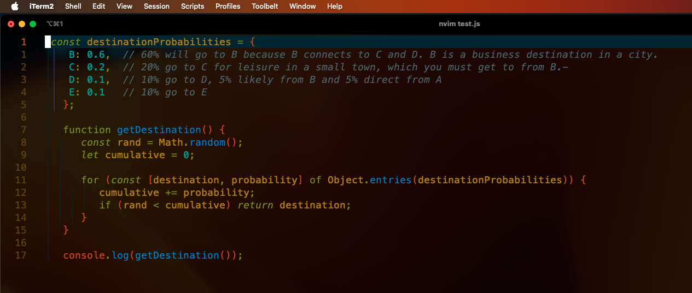

.. I'm on page 214/468 right now <-- NOT STARTED
.. Challenge work required, page 649 question 3 <-- not started
.. assignment 5 is one exercise from chapter 13, 14, 15 and 16
.. QUESTION KEY
.. chapter 13, question 10 page 650
.. chapter 14, question 4, page 684
.. chapter 15, question 3a, 3b, page 724, 725
.. chapter 16, question 4, page 754

Unit five, section one
++++++++++++++++++++++++
Introduction to high level programming

Challenge work submission
===========================

1. Read chapter 13 of the textbook.
2. Complete challenge work #3, on page 649 of the text.

.. note:: 
   Corresponds to challenge work #3, on page 649 of the text. The instructions may say a short profile, but the course Brightspace says 2-3 paragraphs is sufficient.

Works cited
~~~~~~~~~~~~
Schneider, G. Michael, and Judith Gersting. Invitation to Computer Science. 6th ed., Cengage Learning, 2013.

Assignment 5 (chapter thirteen, section five)
==============================================
.. this is technically part 1/4 for assignment 5. The next parts are in the continued chapters, unitFiveSection[n].rst

*10. Assume that you want to model a bus system in which passengers purchase tickets and travel from city A to one of four other cities, either B, C, D, or E. An important part of the model is determining to which city a specific passenger is traveling, a random variable. How might you go about creating a statistical distribution that accurately specifies to which of these four cities a passenger will buy a ticket and travel? (Chapter 13, page 650.)*

To do this, I would create a probability distribution and evaluate historical ticket patterns in sales, which would help me determine the proportion of passengers that travel to different nodes. Otherwise, an estimate might be generated based on factors like population size, activity (leisure or business route likelihood), and demographic (age, factoring likelihood of age versus type of travel). I can establish probabilities based on discrete distribution, once I have this categorical data.

Psuedocode
~~~~~~~~~~~
I'm using a theoretical example that destination B is a main node, and passengers are 60% likely to arrive here regardless of leisure or business because it's cheaper to go to the city and travel from B to C, D, or E. Leisure direct to C is 20% likely, and D is 10% likely given D is nicer than C. Destination E is theoretically 10% and accomodates out of town travellers who come far for work. 

When the program runs, it generates a probability distribution similar to how I'd approach this problem, but without finer levels of data modelling like age, gender, or time of travel.

Solution
~~~~~~~~~
.. code:: javascript

   const destinationProbabilities = {
    B: 0.6,  // 60% will go to B because B connects to C and D. B is a business destination in a city.
    C: 0.2,  // 20% go to C for leisure in a small town, which you must get to from B. 
    D: 0.1,  // 10% go to D, 5% likely from B and 5% direct from A
    E: 0.1   // 10% go to E
   };

   function getDestination() {
      const rand = Math.random();
      let cumulative = 0;

      for (const [destination, probability] of Object.entries(destinationProbabilities)) {
         cumulative += probability;
         if (rand < cumulative) return destination;
      }
   }

   console.log(getDestination());

Runtime
~~~~~~~~

Works cited
~~~~~~~~~~~~
Schneider, G. Michael, and Judith Gersting. Invitation to Computer Science. 6th ed., Cengage Learning, 2013.