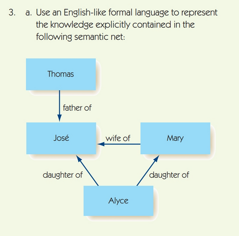
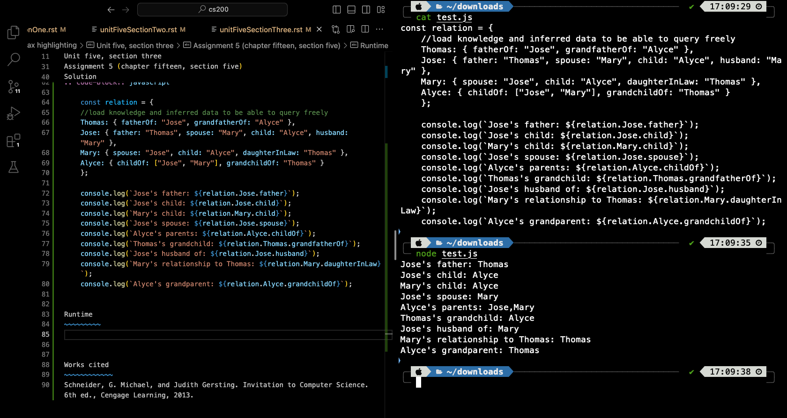

.. I'm on page 214/468 right now <-- NOT STARTED
.. Challenge work required, write a brief review and description of a favourite book or movie depicting AI and/or robotics.
.. assignment 5 is one exercise from chapter 13, 14, 15 and 16
.. QUESTION KEY
.. chapter 13, question 10 page 650
.. chapter 14, question 4, page 684
.. chapter 15, question 3a, 3b, page 724, 725
.. chapter 16, question 4, page 754

Unit five, section three
+++++++++++++++++++++++++++

Artificial intelligence
=========================

Challenge work submission
===========================

1. Read chapter 15 of the textbook.
2. Complete challenge work: write a brief review and description of a favourite book or movie depicting AI and/or robotics.

Works cited
~~~~~~~~~~~~
Schneider, G. Michael, and Judith Gersting. Invitation to Computer Science. 6th ed., Cengage Learning, 2013.

Assignment 5 (chapter fifteen, section five)
==============================================
.. this is technically part 3/4 for assignment 5. The next parts are in the continued chapters, unitFiveSection[n].rst

*3a - 3b. Use an English-like formal language to represent the knowledge explicitly contained in the following semantic net. Add to your list from Exercise 3a the knowledge that can be inferred from the semantic net. (Chapter 15, page 724, 725)*

Solution
~~~~~~~~~

a. Answer

+ Thomas is the parent of Jose.
+ Jose is the child of Thomas.
+ Mary is the wife of Jose.
+ Alyce is the parent of both Jose and Mary.

b. Add to your list from Exercise 3a the knowledge that can be inferred from the semantic net.

+ Thomas is a grandfather of Alyce.
+ Jose is the husband of Mary.
+ Mary is a daughter in law to Thomas.
+ Mary and Jose are married.
+ Alyce is a grandchild to Thomas.

I can use object structs to store relationships, then query them as needed. As an example:

.. code-block:: javascript

    const relation = {
    //load knowledge and inferred data to be able to query freely
    Thomas: { fatherOf: "Jose", grandfatherOf: "Alyce" },
    Jose: { father: "Thomas", spouse: "Mary", child: "Alyce", husband: "Mary" },
    Mary: { spouse: "Jose", child: "Alyce", daughterInLaw: "Thomas" },
    Alyce: { childOf: ["Jose", "Mary"], grandchildOf: "Thomas" }
    };

    console.log(`Jose's father: ${relation.Jose.father}`);
    console.log(`Jose's child: ${relation.Jose.child}`);
    console.log(`Mary's child: ${relation.Mary.child}`);
    console.log(`Jose's spouse: ${relation.Jose.spouse}`);
    console.log(`Alyce's parents: ${relation.Alyce.childOf}`);
    console.log(`Thomas's grandchild: ${relation.Thomas.grandfatherOf}`);
    console.log(`Jose's husband of: ${relation.Jose.husband}`);
    console.log(`Mary's relationship to Thomas: ${relation.Mary.daughterInLaw}`);
    console.log(`Alyce's grandparent: ${relation.Alyce.grandchildOf}`);

Runtime
~~~~~~~~~

Works cited
~~~~~~~~~~~~
Schneider, G. Michael, and Judith Gersting. Invitation to Computer Science. 6th ed., Cengage Learning, 2013.