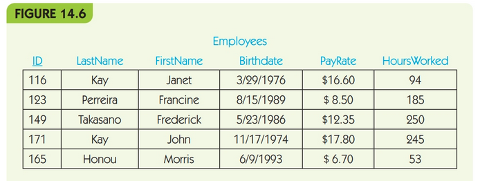

.. I'm on page 214/468 right now <-- NOT STARTED
.. Challenge work required, page 684 question 1 <-- not started
.. assignment 5 is one exercise from chapter 13, 14, 15 and 16
.. QUESTION KEY
.. chapter 13, question 10 page 650
.. chapter 14, question 4, page 684
.. chapter 15, question 3a, 3b, page 724, 725
.. chapter 16, question 4, page 754

Unit five, section two
++++++++++++++++++++++++
Commerce and databases

Challenge work submission
===========================

1. Read chapter 14 of the textbook.
2. Complete challenge work #1, on page 684 of the text.

.. note:: 
   Corresponds to challenge work #1, on page 684 of the text. The instructions may say a short profile, but the course Brightspace says 2-3 paragraphs is sufficient.

Works cited
~~~~~~~~~~~~
Schneider, G. Michael, and Judith Gersting. Invitation to Computer Science. 6th ed., Cengage Learning, 2013.

Assignment 5 (chapter fourteen, section five)
==============================================
.. this is technically part 2/4 for assignment 5. The next parts are in the continued chapters, unitFiveSection[n].rst

*4. what is the result of the following SQL query? (Chapter 14, page 684)*

.. code:: SQL

   SELECT * FROM Employees WHERE HoursWorked < 100;

Solution
~~~~~~~~~

.. table::

   ====== ======== ========= ========== ======== ============
   ID     LastName FirstName Birthdate  PayRate  HoursWorked
   ====== ======== ========= ========== ======== ============
   116    Kay      Janet     3/29/1976  $16.60   94
   165    Honou    Morris    6/9/1993   $6.70    53
   ====== ======== ========= ========== ======== ============

Works cited
~~~~~~~~~~~~
Schneider, G. Michael, and Judith Gersting. Invitation to Computer Science. 6th ed., Cengage Learning, 2013.