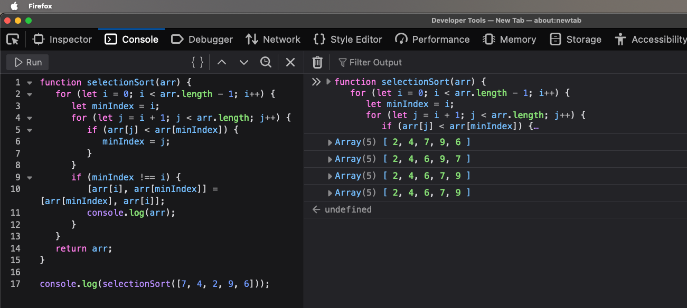

.. I'm on 138/148 right now
.. I have not submitted the challenge work yet
.. an assignment is required for chapter 3 "Assignment 1 – choose ONE exercise each from Chapters 2 and 3"
.. assignment not submitted yet.

Unit one, section three
++++++++++++++++++++++++

    *"After reading this chapter, we now see more than ever why we added efficiency as a desirable feature for an algorithm and why future advances in computer technology won’t change this. No matter how fast computers get, they will not be able to solve a problem of size n = 100 using an algorithm of Θ(2n) in any reasonable period of time"*

General reading notes
======================

* It's possible that you can use the right algorithm, but to the wrong problem.
* Mismatching an algorithm to a problem is one of the most common causes of an incorrect algorithm.
* It's important to ask "are we solving the right problem? are we solving the problem right?".
* Algorithms aren't intended for academic interest. They're meant to be used.
* A great deal of time goes into program maintenance.
* Usually, the person who has to correct the program and maintain it isn't the one who originally wrote the program.
* It's important to make algorithms clear and easy to understand for this reason.
* *Elegance* is the algorithmic equivalent to *style*.
* A computer scientist should be watchful of resourses and performance. If two algorithms solve a problem, the one which consumes fewer resources and is more performant is the correct algorithm.
* *Efficiency* is the term used to describe the care and use of computing resources.
* *Space efficiency* is judged by the amount of information an algorithm stores in the memory, in addition to initial input data.
* If you try to measure algorithm efficiency with a stop watch, you'd be measuring hardware and not the algorithm itself.
* It's not to say that the stop watch method is useless. You can do benchmarking with this technique.
* To measure algorithm efficiency, we check the amount of work the algorithm takes, independent of the hardware.
* The stufy of algorithmic efficiency is called *analysis of algorithms*.
* Sequential search algorithms aren't efficient for large values of *n*. Best case 1, worst case *n*, average case *n/2*.
* A sequential search algorithm stores only a few peripheral variables, which is small in comparison to the value of *n*. It's space efficient.
* A peripheral value is constant and doesn't really matter in terms of the space efficiency calculations because of *order of magnitude*. If c = constant, and n = number of data, then the total work is c(n). This means the peripheral work is constant and scales with the throughput.
* Order of magnitude of n is written as O(n), and it's anything with a constant that scales irrelevant to the input linearly, since the constant is so insignificant to the time efficiency, it's discarded.
* For linear search, the algorithm equation to calculate average case is roughly half but the real equation is much more complicated than that. Use n / 2 for now.
* The selection sort algorithm performs a sort of a list, and it *grows* a sorted subsection of the list from the back to the front.
* The selection sort does comparisons and exchanges. That needs to be factored into a constant calculation.
* Work contributed by exchanges and marker moving is so much less than the amount contributed by comparisons that it can be ignored
* Despite needing a temporary location in memory to hold a value while the swap occurs, selection sort is space efficient and the required overhead to do the swap is nominal in comparison to the compare overhead.
* The selection sort is O(n^2) in all cases unlike a sequential search which is O(n).
* O(n^2) grows approximately to the square of the rate, unlike O(n) which grows linear to the problem size.
* O(n^2) grows much faster than O(n). When you look at a line chart, the curved one growing upwards, quickly, is most likely to be O(n^2).
* No matter what the constants are, O(n^2) has a faster growth rate than O(n).
* In case it comes up on a test question, the analogy used in the textbook between the two orders of magnitude are walking vs driving, where walking activities can vary between jogging and running, driving can vary between sports engines and economy vehicles. The constants are the modes of transportations, but the two (walking vs driving) are "quantum leaps".
* If you have to choose, choose the algorithm with the lesser order of magnitude.
* We care about runtime expressions when we have a large order of (n) to be concerned with.
* For small factors of (n), the constant factor for time efficiency is nominal.
* FLOPs are Floating-Point Operations per Second. It's the comparitive performance amongst different computers. We look at how many arithmetic operations the CPU can do in one second, and we compare that.
* A supercomputer is almost 82k times faster than a standard desktop.
* A compartive study shows that a supercomputer falls behind a standard computer, despite higher FLOPs, because the supercomputer was using O(n^2) vs O(n) after the input of (n) grew.
* To analyze the time efficiency of an algorithm, you look at the fundmental units of work the algorithm performs.
* Choosing a faster algorithm at the cost of space is called time/space trade-off.
* The number of times (n) can be cut in half and not go below 1 is called the logarithm of (n) to the base of 2, which is abbreviated lg (n), log (n), log2 (n).
* The textbook notes that O(lg n) is equivalent to various modes of flying, using the transport analogy earlier. It's exponentially faster.
* The difference in FLOPs can mitigate but not eliminate the difference in algorithm time efficiency.
* Pattern search might also be known as forward march algorithm.
* A collection of nodes connecting edges is calle a graph.
* A path through a graph that begins and ends at the same node and goes through all other nodes once is called a Hamiltonian circuit, named after an irish mathematician William Rowan Hamilton.
* Hamiltonian circuits can be unbound by polynomial expression and can be considered trial searches. They are exponential algorithms of O(2^n).
* Hamiltonian problems are also known as brute force algorithms.
* If an O(n^2) and an O(n) algorithm exist for a problem, then the O(n) will be faster, regardless of the peripherals inside of it. This is the rationale for ignoring constant factors and concentrating on the basic order of magitude for algorithms.
* A problem where no polynomial bounded algorithm exists is called an intractable. They are solvable, but the solution requires so much work that it's useless. Hamiltonian circuits are intractable. No one has found a solution in polynomial time yet.
* Another intractable is the bin-packing problem.
* We approach these intractables with approximate algorithms. They do not solve the problem, but they get us close.

*Notes are ongoing, pending completion*

The efficiency of algorithms
=============================

Algorithm speed
~~~~~~~~~~~~~~~~
If an O(n^2) and an O(n) algorithm exist for a problem, then the O(n) will be faster, regardless of the peripherals inside of it. This is the rationale for ignoring constant factors and concentrating on the basic order of magitude for algorithms.

Polynomial expressions
~~~~~~~~~~~~~~~~~~~~~~~
If an algorithm has higher orders of magnitude **and has lower order of magnitude operations** in it's runtime expression, it's still considered a higher order of magnitude. This is because we concentrate on worst-case efficiency, and lower order terms have insignificant effect on scalability.

    **T(n) = 15(n^2) + 5(n) + 3
    T(n) = O(n^2)**

Selection sort
~~~~~~~~~~~~~~~
Selection sort is an O(n^2) algorithm in all cases, and sequential search is an O(n) algorithm in the worst case."

Shuffle left
~~~~~~~~~~~~~
The shuffle left algorithm is O(n^2) in the worst case, but it is space efficient since it only needs ~4 memory allocations to store (n), left index, right index, and the array itself.

Copy over
~~~~~~~~~~
The copy over algorithm can be faster, but costs more in space allocation. In the best case, no copies are made. In the worst case, every item is copied. Interestingly, the shuffle left and copy over algorithms are opposite in that they do not share the same best and worst case scenarios. 

Time space trade-off
~~~~~~~~~~~~~~~~~~~~~
The copy over algorithm is faster and O(n), but it essentially would double memory allocation with a second array. This trade-off when choosing between two algorithm types is called the time/space trade-off.

It's hard to have both at once.

Converging pointers
~~~~~~~~~~~~~~~~~~~~
The converging pointers algorithm. This algorithm parses the array and swaps index positions, until the index of the left and right pointer converge. Then the array is checked again for values before running once more. This algorithm requires no more space than the shuffle left algorithm, but it's as fast as the copy over algorithm.

Binary search
~~~~~~~~~~~~~~~
Similar to the sequential search algorithm, but unfortunately **only works on a sorted list.**

Binary search only needs a small amount of additional storage, like sequential search.

Binary search does O(lg n) in the worst case and in the average case.

Logarithm
~~~~~~~~~~
The number of times a number (n) can be divided in half and not go below 1 is called the logarithm of (n) to the base of 2. 

It's annotated lg (n), log (n), log2 (n). 

    *lg 16 = 4
    lg n = m which is equal to 2(m) = n*

Log (n) grows slower than (n). As (n) doubles, generally, log (n) increases by +1.

Pattern matching
~~~~~~~~~~~~~~~~~
The pattern search may also be known as the forward march, and is an O((m) x (n)) algorithm in the worst case, but O(n) in the best case. Interestingly uses two measures of input size, (n) for the input size, and the length of the text string (m). The equation to calculate pattern matching efficiency usually goes *n - m + 1*.

The best **and** worst case for this algorithm are when the pattern is not available at all. The difference hinges on *how* the pattern fails to be in the text.

+ The best case is when the first character of the pattern is nowhere in the text.
+ The worst case is when the pattern *almost* exists everywhere in the text.

Intractables
~~~~~~~~~~~~~~
Some algorithms can't be solved without their peripherals making them entirely useless. These are exponential algorithms, and their problems are called intractable. They're usually used to solve trial search problems like Hamiltonian circuits. To date, they have not been solved, so we use approximate algorithms to get us close, like brute force approaches.

Exponential algorithms are not expressed in polynomial time and are O(2^n).

Summary
~~~~~~~~
O(n) is proportional to (n). If you double (n), you double the work. O(n^2) is proportional to the *square* of (n).

Time annotation is in big O notation, but space is in runtime expression because time is more elastic than space. We *want* an algorithm to run in the shortest time possible, but there is usually no cap. There is a cap for space, so the notation is more precise.

If you have to sort a list, even with a higher order of magnitude, to then use an algorithm with a lower order of magnitude on a search, it would be more optimal than performing a search with a higher order of magnitude to avoid sorting a list.

The difference in FLOPs can mitigate but not eliminate the difference in algorithm time efficiency.

O(lg n) does less work as (n) grows because a logarithm is the base of (n) by 2. An exponential algorithm is called a Hamiltonian circuit, and they're often trial search algorithms through paths of graphs, or connected nodes. These exponential algorithms are O(2^n).

Challenge work submission
===========================

1. Read chapter three of the textbook.
2. Locate an resource which discusses attributes of algorithms discussedin chapter 3. Post a link with a brief review.

.. note:: 
   To watch this video, follow this link: https://www.youtube.com/watch?v=YX40hbAHx3s

P vs NP
~~~~~~~~
This video does a roughly 10 minute overview of seven problems known as **The Millenium Prize Problems**, of which, **P vs NP** was included. The **P** stands for polynomial time, and **NP** stands for non-deterministic polynomial time. The problems affiliated with an **NP** problem are known as intractables, something we learn about in this chapter of study. The video talks about how important it was historically to solve problems with efficiency, since early computing didn't have the resources for the most time efficient algorithms, so we grew a need to reduce our space time complexity.

As we moved along, we found very quickly that some solutions could be near impossible to prove efficiently, let alone compute.

The question of **P vs NP** asks an interesting question in the area of computer science and mathematical computation surrounding intractables; *"Does being able to quickly recognize correct answers mean there is also a quick way to find them?"*.

An especially thought provoking quote is left at the end of the video regarding the pursuit of finding **NP-complete problems**: *"If P=NP, then the world would be a profoundly different place... everyone who could appreciate a symphony would be Mozart"*.

.. tip::
   P=NP is written as an expression to theoretically acknowledge that NP problems can be solved in polynomial time.

Works cited
~~~~~~~~~~~~
"P vs NP: The Biggest Unsolved Problem in Computer Science." YouTube, uploaded by Veritasium, 9 Sept. 2021, https://www.youtube.com/watch?v=YX40hbAHx3s. Accessed 28 Dec. 2024.

Schneider, G. Michael, and Judith Gersting. Invitation to Computer Science. 6th ed., Cengage Learning, 2013.

Assignment 1 (chapter one, section three)
==========================================
.. this is technically part 2/2 for assignment 1. The first part is in the previous chapter, unitOneSectionTwo.rst

*7. Perform a selection sort on the list 7, 4, 2, 9, 6. Show the list after each exchange that has an effect on the list ordering. (Chapter 3, page 140.)*

Psuedocode
~~~~~~~~~~~
This problem is familiar to my experience programming algorithms in College when I studied computer programming, but I am applying a newfound understanding of what's happening in time complexity.

    // declare function selectionSort

    // iterate through elements in array (n)

    // declare var minIndex to current [i]

    // find smallest element in the unsorted section

    // if smaller element == true, minIndex to [i]

    // if minIndex != [i], swap elements

    // i need to log or output the array to show list after swap, if exchange == true

    // repeat until last element is reached

    // output sorted array again, final 

Solution
~~~~~~~~~
.. code:: javascript

   function selectionSort(arr) {
   for (let i = 0; i < arr.length - 1; i++) {
      let minIndex = i;
      for (let j = i + 1; j < arr.length; j++) {
         if (arr[j] < arr[minIndex]) {
            minIndex = j;
         }
      }
      if (minIndex !== i) {
         [arr[i], arr[minIndex]] = [arr[minIndex], arr[i]];
         console.log(arr);
      }
    }
    return arr;
    }

    console.log(selectionSort([7, 4, 2, 9, 6]));

Runtime
~~~~~~~~

Works cited
~~~~~~~~~~~~
Schneider, G. Michael, and Judith Gersting. Invitation to Computer Science. 6th ed., Cengage Learning, 2013.
