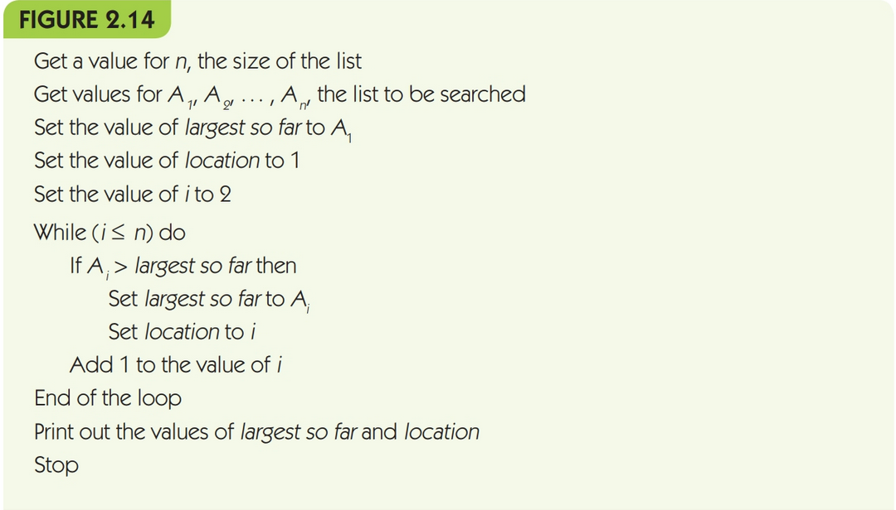
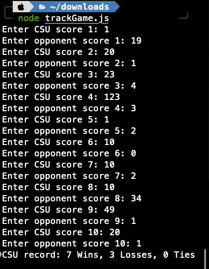
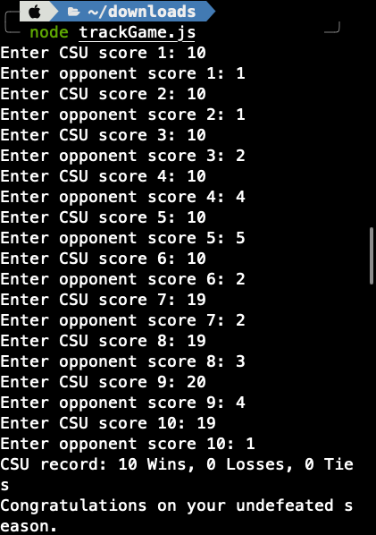

.. I'm on 83/89 right now
.. I submitted the challenge work on 22 DEC 2024 11:20 EST
.. an assignment is required for chapter 2 "Assignment 1 – choose ONE exercise each from Chapters 2 and 3"
.. assignment submitted 28 DEC 2024 - submission 119953

Unit one, section two
++++++++++++++++++++++

    *"an algorithm is deemed correct only when it produces the correct result for all possible cases."*

General reading notes
======================

* Psuedocode is an informal and natural way to express a program design. It's a design notation.
* High-level programming languages have a high level of abstraction from machine language, so they're close to plain speak, but they carry cryptic syntax.
* Psuedocode ignores the cryptic syntax of high-level programming language, making the transfer of an idea during the programming concept easier.
* Psuedocode is simple, highly readable, and has virtually no grammatical rules. It's often called *a programming language without the details*
* In psuedocode, it doesn't matter how you write your instructions. They just need to be clear, effective, computable, and unambiguous.
* A variable is a named storage location which holds data. It's often compared to a mailbox where you can place a value and retrieve it.
* An algorithm that lacks routes or options is called a sequential algorithm, or a straight-line algorithm. The control flow for it is linear and it's execution is top-down.
* Conditional and iterative operations are called control operations.
* Conditional statements are the question asking operations of an algorithm, the if/then/else statements.
* Iteration is akin to looping, which is called the while statement.
* In a while statement, the value that evaluates if the condition is still true is called the continuation condition.
* The part of a while condition that is executed as long as the continuation condition is met is called the loop body.
* If for some reason the continuation condition never becomes false, then we have an infinite loop.
* A pretest loop is when the continuation condition is checked at the beginning before the loop body executes on each pass. In this case, it's possible the loop never executes at all.
* A more useful approach is the posttest loop where the continuation condition is checked at the bottom or end of the loop body on each pass rather than the start.
* In a do/while condition, the loop is always executed at least once.
* A while condition can execute 0, 1, 2, or more times.
* To be considered effective, algorithms need to accomplish tasks in a reasonable time.
* A sequential search algorithm takes an array of data and parses it without any sort.
* An algorithm is deemed correct only when it produces the correct result for *all* possible cases.
* In while loops, we use an index pointer, usually a variable denoted as *i*. This acts as a moving finger scanning the list of data as we iterate through the loop.
* The selection of an algorithm to solve a problem is greatly influenced by the way the input data for that problem are organized.
* A sorting algorithm can reduce the time it takes to use a sequential search algorithm.
* A collection of prewritten algorithms is called a library, and they are important tools in design and development for more algorithms.
* "compare and save or discard" is referring to a sorting algorithm in the text. If it comes up in a test, it's probably going to ask which algorithm does this correlate to.
* Instructions that tell us not to do anything are usually omitted from an algorithm, because they do not carry any meaningful information.
* The process of searching for a special pattern of symbols within a larger collection of information is called *pattern matching*.
* Most word processors and text editors provide this as a feature in the **Find** tool.
* Pattern matching can be applied to any media type.
* Abstraction refers to the separation fo the high-level view of an entity or an operation from the low-level details of its implementation.
* Abstraction is one of the most important tools in computer science.
* In the design process, we use abstraction to ignore how we'll implement an algorithm so we can focus on the details of the design.
* This is called top-down design. (viewing the problem at a high level, implementing the details later).
* A *sliding forward* step in an algorithm helps to begin searching for a pattern in the next array or sequential position.
* When you use the *sliding forward* step, you can fall off the search string or input by exceeding the length of the search sequence. You need to terminate the sliding search by the length value.
* Designing a technically correct algorithm to solve a given problem is only part of what computer scientists do. We must also ensure that we have the most efficient algorithm.

**Algorithm discovery and design**

Finding a solution to a given problem is called *algorithm discovery*.

When you write psuedocode, it needs to carry three basic sequential operations:

1. Computation
2. Input
3. Output

Practice problem A
~~~~~~~~~~~~~~~~~~~~
An algorithm that gets three data values `x`, `y`, and `z` as input and outputs the average of those three values.

.. code-block:: javascript

   // declare variables x,y,z
   // create a function with x,y,z as arguments
   // in the function, return the sum of all variables divided by three
   // run the function which gets user inputs for x,y,z

   let x = 0;
   let y = 0;
   let z = 0;

   function averageValues(x,y,z){
      return (x + y + z) / 3;
   }

   console.log(averageValues(3,2,1))

Practice problem B 
~~~~~~~~~~~~~~~~~~~~
Write an algorithm that gets as input three data values `x`, `y`, and `z` and outputs the average of these values **if the value of x is positive**. If the value of `x` is either `0` or negative, your algorithm should not compute the average but should print the error message *Bad Data* instead.

.. code-block:: javascript

   // create a function with x,y,z as arguments, declaring vars in scope
   // in the function, return the sum of all variables divided by three if:
   // x is greater than zero. Else, if x is less than zero, return "Bad Data" 
   // return null when it's printing Bad Data
   // run the function which gets user inputs for x,y,z

   function averageValues(x,y,z){
      if (x > 0) {
      return (x + y + z) / 3;
    }
      else { 
      console.log("Bad Data");
      return null;
    } 
   }

   console.log(averageValues(0,2,1))

Practice problem C
~~~~~~~~~~~~~~~~~~~~
Modify the algorithm of Figure 2.14 so that it finds the smallest value in a list rather than the largest. Describe exactly what changes were necessary

.. code-block:: javascript

   // declare a flag to check if swap is done or not
   // do: set flag to false
   //   for loop while the counter is less than the array length.. 
   //   if the array index n is greater than the index of n + 1...
   //   swap the elements. 
   //   swap = array n, array n + n = array n + 1, array n
   //   set swap flag to true to restart
   // use postcheck: while the flag is false...
   // return sorted array

   function sortArray(arr) {
   let swapCheck;

   do {
      swapCheck = false;
      for (let i =0; i < arr.length - 1; i++) {
         if (arr[i] > arr[i + 1]) {
         [arr[i], arr[i + 1]] = [arr[i + 1], arr[i]];
         swapCheck = true;
       }
      }
    } while (swapCheck);
    return arr;
   }

   console.log(sortArray([10,1,5,17,2]));

I re-wrote the algorithm to be designed behind a dynamically typed programming language, and not a static one. Variables are declared as I use them, specifically the counter and index, so it's omitted from the psuedo. I changed the operand which checks if the array index is smaller, to checking if it's larger. 

I also switched the continuation condition to a postcheck for better error handling, since there's a possibility that the loop would not run at all.

Challenge work submission
===========================

1. Read chapter two of the textbook.
2. Complete challenge work #3, on page 88 of the text.

.. note:: 
   Corresponds to challenge work #3, on page 88 of the text. The instructions say a short paper, but the course Brightspace says 2-3 paragraphs is sufficient.

The mathematical contributions of Liu Hui, 263 CE 
~~~~~~~~~~~~~~~~~~~~~~~~~~~~~~~~~~~~~~~~~~~~~~~~~~~
Recently in 2023, Liu Hui was commemorated at the 42nd session of the General Conference (Global Times, 2023) to celebrate the anniversary of his birth.

Liu Hui was a brilliant mathematician and ancient chinese scholar who made significant contributions to todays use of computer science in graphics programming, which are documented with detailed mathematical proof in his work: the *Nine Chapters on the Mathematical Art* (J-C Martlzoff, 1997).

His contributions in the *Nine Chapters on the Mathematical Art* were the foundation for todays advancements in computing that we see in graphics programming and 3D rendering. His contributions include polygonal approximations using iterative refinement to improve accuracy, volume calculations, and geometric dissections (Liu Hui, 263 CE).

His work in iterative refinement contributes to todays ability for building polygonal meshes in computing, and his work in volume calculations allows us to achieve voxel rendering and physics simulations. Without his foundational work in geometric dissections, computer science would be unable to have built the binary search partition we use today to compute computational geometry in 3D space, including collision detection. 

The foundational work Liu Hui has been described as *"a light of wisdom spanning two millennia"* in computing and in mathematics, since the *Nine Chapters* serves as a current bridge to connect abstract mathematical theories with practical application (Global Times, 2023).

Works cited
~~~~~~~~~~~~
"Chinese Mathematician Liu Hui's Contributions to Geometry and Computational Techniques." Global Times, 9 Sept. 2024, www.globaltimes.cn/page/202409/1320363.shtml. Accessed 22 Dec. 2024.

"Liu Hui." MacTutor History of Mathematics Archive, University of St Andrews, www.mathshistory.st-andrews.ac.uk/Biographies/Liu_Hui/. Accessed 22 Dec. 2024.

Martzloff, J.-C. A History of Chinese Mathematics. Springer-Verlag, 1997.

Foley, James D., and Andres Van Dam. Fundamentals of Interactive Computer Graphics. Systems Programming Series, 1st ed., Addison-Wesley, 1982.

Schneider, G. Michael, and Judith Gersting. Invitation to Computer Science. 6th ed., Cengage Learning, 2013.

Assignment 1 (chapter one, section two)
========================================
.. this is technically part 1/2 for assignment 1. The second part is in the next chapter, unitOneSectionThree.rst

7. Write an algorithm that uses a loop (1) to input 10 pairs of numbers, where each pair represents the score of a football game with the Computer State University (CSU) score listed first, and (2) for each pair of numbers, determine whether CSU won or lost. After reading in these 10 pairs of values, print out the won/lost/tie record of CSU. In addition, if this record is a perfect 10-0, then print out the message 'Congratulations on your undefeated season.' (Chapter 2, page 84)

Psuedocode
~~~~~~~~~~~~
I chose this question because it reminds me of programming iteration based counting algorithms from my time studying computer programming at college. I am now able to approach this problem with a much deeper understanding of what is happening in polynomial time.

   // declare function trackGame, include readline to run from terminal, stdout and in

   // initialize counter for win, loss, tie

   // if count is less than 10 times, get input pairs of scores

   // read line for input CSU score && opponent score

   // if CSU > opponent, win++

   // if CSU < opponent, loss++

   // else if scores ==, ties++

   // output totals for win, loss, tie

   // check if record is perfect 10-0. If perfect == true, send congrats to console

   // close readline

Solution
~~~~~~~~

.. code:: javascript

   const readline = require('readline');

   const rl = readline.createInterface({
   input: process.stdin,
   output: process.stdout
   });

   function trackGame() {
   let wins = 0, losses = 0, ties = 0;
   let count = 0;

   function askQuestion() {
      if (count < 10) {
         rl.question(`Enter CSU score ${count + 1}: `, (csuScore) => {
            rl.question(`Enter opponent score ${count + 1}: `, (opponentScore) => {
               csuScore = parseInt(csuScore);
               opponentScore = parseInt(opponentScore);

               if (csuScore > opponentScore) {
                  wins++;
               } else if (csuScore < opponentScore) {
                  losses++;
               } else {
                  ties++;
               }

               count++;
               askQuestion();
            });
         });
      } else {
         console.log(`CSU record: ${wins} Wins, ${losses} Losses, ${ties} Ties`);
         if (wins === 10 && losses === 0) {
            console.log("Congratulations on your undefeated season.");
         }
         rl.close();
      }
   }

   askQuestion();
   }

   trackGame();

Runtime
~~~~~~~~
Case loss:

Case win:

Works cited
~~~~~~~~~~~~
Schneider, G. Michael, and Judith Gersting. Invitation to Computer Science. 6th ed., Cengage Learning, 2013.