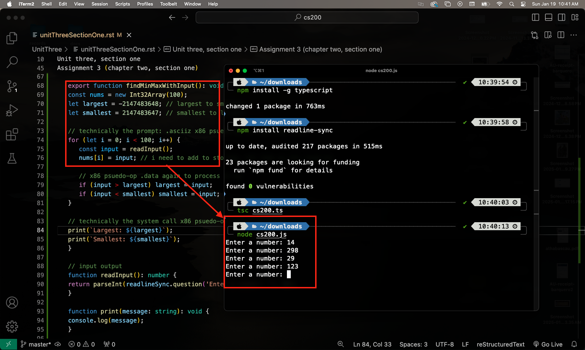
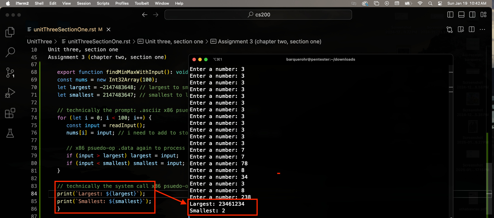

.. I'm on page 214/332 right now <-- NOT STARTED
.. Challenge work required, page 328 question 1 <-- DONE, submitted feb 1 2025
.. assignment 3 is one exercise from chapter 6, 7, and 8
.. QUESTION KEY
.. chapter 6, question 13 page 329
.. chapter 7, question 10 page 385
.. chapter 8, question 9 page 418

Unit three, section one
++++++++++++++++++++++++
System software and virtual machines

Challenge work submission
===========================

1. Read chapter six of the textbook.
2. Complete challenge work #1, on page 328 of the text.

.. note:: 
   Corresponds to challenge work #1, on page 328 of the text. The instructions may say a short paper, but the course Brightspace says 2-3 paragraphs is sufficient.

Modern thermostats (smart device)
~~~~~~~~~~~~~~~~~~~~~~~~~~~~~~~~~~
In most modern homes, a smart thermostat will be present since home owners may opt for automation and energy savings. Although there are many brands, the thermostats share a similar user interface which makes them familiar to use.

The interface typically includes a digital touchscreen display, a dial and digital buttons for manual control. These icons, buttons, and features are usually shared in a mobile app which allows remote access. The screen shows output data like temperature readings, settings,humidity, time of day, schedule, and mode of operation (cooling, heating, idle).

The interface is user-friendly and uses self describing icons, focusing on clarity and convenience. In a practical example, you may see similar icons to the image listed below, which makes it self explanatory to understand what each may do (for example, a snowflake for cooling):

Image source: `Don's Notes. "Ecobee Thermostat Manual." <https://donsnotes.com/tahoe/cabin/manuals/ecobee.html>`_

 .. image:: /images/CS200_ecobee-icons.jpg

In a new IoT and smart device trend, some thermostats are equipped with voice active controls, which helps users gain more control of their systems and allows better inclusivity to those with accessibility requirements. Unlike computers, smart thermostats have a lower barrier of entry in their user interface since the focus is on simplicity and convenience rather than streamlined functionality.

An example of this is seen when comparing different brands of smart thermostats to eachother. The icons and simplicity is maintained, unlike in computer when you compare different machines to themselves, like an apple product compared to a windows product (windows versus command key, option versus alt key, finder rather than file explorer, terminal rather than command promp, and so on).

Works cited
~~~~~~~~~~~~
Schneider, G. Michael, and Judith Gersting. Invitation to Computer Science. 6th ed., Cengage Learning, 2013.

Don's Notes. "Ecobee Thermostat Manual." Don's Notes, 1 Feb. 2025, https://donsnotes.com/tahoe/cabin/manuals/ecobee.html. Accessed 1 Feb. 2025.

Assignment 3 (chapter three, section one)
===========================================
.. this is technically part 1/3 for assignment 3. The second part is in the next chapter, unitThreeSectionTwo.rst

*13. Write a complete assembly language program (including all necessary pseudo-ops) that reads in a series of integers, one at a time, and outputs the largest and smallest values. The input will consist of a list of integer values containing exactly 100 numbers.* (Chapter 6, page 329)

.. warning::
   Because I am not fluent in assembly language, I opted for AssemblyScript, since I am most comfortable with javascript and typescript. Since it's a high-level programming language with low-level controls (similar to assembly), there are no psuedo-op directives and so I've used functions in lieu of this, commenting where the directive for a psuedo op would normally be in x86 assembly. The benefit is that my program is shorter and more elegant, since assembly programs are verbose. This should satisfy the question requirements since the psuedo-ops are present in comments, but the execution and syntax changes.

The program
~~~~~~~~~~~~
In order to run this program, you need to:

1. From terminal, install npm with `npm install -g npm`
2. To install typescript, enter `npm install -g typescript`
3. Then enter `npm install readline-sync`
4. You may have 1 critical vulnerability. If you do, follow the prompt to audit and patch the update
5. Save the code block below as a `.ts` file to your machine.
6. From the same directory, run `tsc [filename].ts`
7. Finish by using node to execute the js compiled output
   

.. code-block:: javascript

   /* 
   psuedo:
   1. init array for 100 ints
   2. read and store 100 ints
   3. find largest and smallest
   4. ouput the values from step 3
   */

   // technically the x86 psuedo-op .data to define ints
   import * as readlineSync from 'readline-sync';

   export function findMinMaxWithInput(): void {
   const nums = new Int32Array(100);
   let largest = -2147483648; // largest to smallest
   let smallest = 2147483647; // smallest to largest

   // technically the prompt: .asciiz x86 psuedo-op to read user data
   for (let i = 0; i < 100; i++) {
      const input = readInput();
      nums[i] = input; // i need to add to storage, not take as one readLine

      // x86 psuedo-op .data again to process array
      if (input > largest) largest = input;
      if (input < smallest) smallest = input;
   }

   // technically the system call x86 psuedo-op .extrn to print
   print(`Largest: ${largest}`);
   print(`Smallest: ${smallest}`);
   }

   // input output
   function readInput(): number {
   return parseInt(readlineSync.question('Enter a number: '), 10);
   }

   function print(message: string): void {
   console.log(message);
   }

   // calls func so it executes after .ts conversion
   findMinMaxWithInput();

Run-time
~~~~~~~~~

**The setup and user input**

**The final output after x100 user specified inputs**

Works cited
~~~~~~~~~~~~
Schneider, G. Michael, and Judith Gersting. Invitation to Computer Science. 6th ed., Cengage Learning, 2013.

AssemblyScript Team. "Introduction." AssemblyScript, AssemblyScript, https://www.assemblyscript.org/introduction.html. Accessed 19 Jan. 2025.