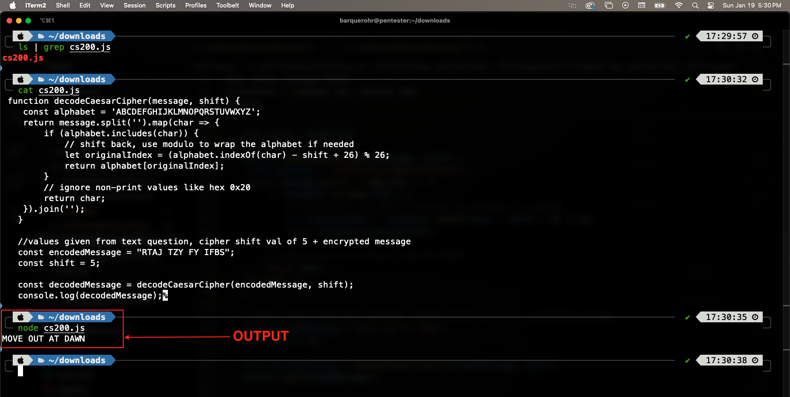

.. I'm on page 214/422 right now <-- NOT STARTED
.. Challenge work required, page 419 question 2 <-- NOT STARTED
.. assignment 3 is one exercise from chapter 6, 7, and 8
.. QUESTION KEY
.. chapter 6, question 13 page 329
.. chapter 7, question 10 page 385
.. chapter 8, question 9 page 418

Unit three, section three
++++++++++++++++++++++++++

Information security
=====================

Challenge work submission
===========================

1. Read chapter eight of the textbook.
2. Complete challenge work #2, on page 419 of the text.

.. note:: 
   Corresponds to challenge work #2, on page 419 of the text. The instructions may say a short paper, but the course Brightspace says 2-3 paragraphs is sufficient.

Works cited
~~~~~~~~~~~~
Schneider, G. Michael, and Judith Gersting. Invitation to Computer Science. 6th ed., Cengage Learning, 2013.

Assignment 3 (chapter three, section two)
===========================================
.. this is technically part 3/3 for assignment 3. The earlier parts are in the prior pages, unitThreeSectionOne.rst, and unitThreeSectionTwo.rst

*9. Using a Caesar cipher with s = 5, decode the received message RTAJ TZY FY IFBS.* (Chapter 8, page 418)

How it works 
~~~~~~~~~~~~~
The caesar cipher shifts each letter by a fixed value, forward for encryption and backward for decryption. My javascript solution decodes the message by shifting letters backward, using the modulo operator to handle wrapping, and discards non-alphabetic characters. It returns the decoded string after adjusting each letter's position.

The output is: `MOVE OUT AT DAWN`

Program
~~~~~~~~

.. code-block:: javascript

   function decodeCaesarCipher(message, shift) {
    const alphabet = 'ABCDEFGHIJKLMNOPQRSTUVWXYZ';
    return message.split('').map(char => {
        if (alphabet.includes(char)) {
            // shift back, use modulo to wrap the alphabet if needed
            let originalIndex = (alphabet.indexOf(char) - shift + 26) % 26;
            return alphabet[originalIndex];
        }
        // ignore non-print values like hex 0x20
        return char; 
    }).join('');
   }

   //values given from text question, cipher shift val of 5 + encrypted message
   const encodedMessage = "RTAJ TZY FY IFBS";
   const shift = 5;

   const decodedMessage = decodeCaesarCipher(encodedMessage, shift);
   console.log(decodedMessage);

Run-time
~~~~~~~~~

Works cited
~~~~~~~~~~~~
Schneider, G. Michael, and Judith Gersting. Invitation to Computer Science. 6th ed., Cengage Learning, 2013.