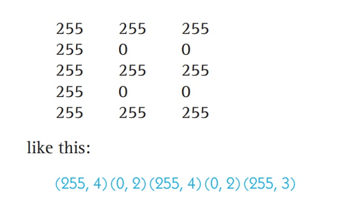

.. I'm on page 173/218 right now
.. Challenge work required, page 217 question 3
.. assignment is ??

Unit two, section one
++++++++++++++++++++++

   *"currently working, nothing to see here"*

General reading notes
======================

* 10 decimal is numerics, and sign/magnitude is +(n) or -(n) notation. Decimal notation is used for real numbers, and a decimal point separates fractional parts. Alpha chars for A-Z.
* Computers use an internal and external representation of these, what the machine sees and what we see are different.
* Internally, computers use binary.
* Binary is a base 2 positional numbering system.
* Decimal is a base 10.
* In a base 2 positional numbering system, the worth of a number is based on it's position, not it's value.
* Bits is the contraction of binary and digits.
* Any whole number that can be represented in base 10, can be represented in base 2, but it will take more digits to represnt a decimal digit in binary.
* To convert decimal to binary, we use the decimal to binary algorithm, dividing the decimal by two and examining the quotient. The remainder represents the binary of 1 or 0. We do this again until the decimal value has a quotient of 0.
* In every computer, there is a maximum of binary digits that can be used to store an int. Usually, 16, 32, or 64 bit systems.
* in an 8 bit, max value is 11111111. In 16 bit, it would be 16x1 for a total of 65,535 bits. Anything over this cannot be represented without a higher bit system.
* Attempting to represent a binary digit larger would result in a buffer overflow, or arithmetic overflow.
* One of the differences in math and computer science is that in math, a quantity can take any representation. Computer science deals with finite representations, and it has to handle errors for exceeding those.
* In binary addition, if you add 1+1 you get 10, which in base 2 is a total of 2.
* I recommend looking up a video on how to add binary numbers, because the text book doesn't present this well. It's easier to see in a short video.
* Binary can also represent signed integers and characters. For signed ints, it will have a 1 for minus, and 0 for addition. For example 1 110001 is -49, and 0 000011 is +3.
* The meaning of a binary number is based solely on the context in which it's used, meaning that a computer technically doesn't know the difference between 1110001 and 1 110001. It's the context of how we use it.
* This isn't irregular when you think about the english language i.e ball (sports) vs ball (event).
* The reason is to avoid the messy representation of negative zero (1 00000..000) vs zero (0 0000...0000). Consider if a = b, do X. Else do y. What if both are 0, but one is + and the other -?.
* To avoid this, computer designers prefer signed int's that don't suffer the two zero problem, hence the context.
* Two's complement representation is when you write binary patterns in a circular form in increasing order. The positive works clockwise, whereas the negative is counter clockwise.
* In the Two's Complement Representation, there is only a single zero (000 ... 0000). There is a problem with the existence of a singular zero pattern.
* In the two's complement representation, you always have one more negative number than positive. 
* This is not as severe a problem as having two zeroes.
* The two's complement is widely used.
* Fractional numbers can be conveted to binary, but first need to be converted using scientific notation. +- M x B ^+-E. M is the mantissa, B is the exponent base, usually 2 and E is the exponent.
* Textual information is stored in binary via a preallocated number, called code mapping. for example, in an 8 bit system, A could be 1. This again means the machine determines if it's char A or decimal 1, based on context.
* ASCII = american standard code for information interchange, and it uses 8 bits to represent chars. It can encode a total of 2^8 or 256 chars.
* ASCII assigns int chars 0 to 255. 32-126 are printable chars, the remainder are non printed chars.
* UNICODE uses 16 bit and is increasingly popular. 2^16 or 65,536 chars allows more symbols. Unicode has 50000 mapping in it's standard.
* Sound is analog information. In analog representation, objects can take any value.
* The amplitude of a wave is equivalent to volume. The period of a wave is designated as T, and corresponds as time.
* f is frequency, the number of cylces per unit time, measured in cycles per second *hertz* hz. The equation is f=1/T. Frequency is a measure of pitch.
* The higher the frequency, the higher the tone pitch. Humans can hear 20 to 20,000 hz.
* To store a frequency waveform, analog must be digitized. This is called sampling.
* The accuracy of encoding and decoding these waveforms is dependent on sampling rate and bit depth. 
* Sampling rate measures how many times per second we sample the amplitude of the waveform.
* To be effective, it needs to be nearly double the hz a human can hear, totalling 40,000 samples per second.
* The bit depth is the number of bits used to encode each sample.
* Most audio encoding schemas use either 16 or 24 bit encoding, allowing 65000 or 16000000 distinct amplitude levels.
* The textbook lists popular encoding schemas WAV (waveform audio format), AAC (advanced audio coding), WMA (windows media audio), MIDI (musical instrument digital interface) and MP3, MPEG-1 audio level 3 encoding. MPEG = motion picture experts group.
* MP3 uses 44100 samples per second, 16 bit.
* encoding process in imagery is called scanning. Scanning measures the intensity values of distinct points located at regular intervals across the images surface.
* These points are called pixels.
* We store different values of bits in each pixel to make use of grayscale. As an example, a pixel with 3 bits can have 2^3 or 8 shades of increasing intensity, whereas a pixel with a bit option of 1 or 0 would produce a stark black and white image.
* This technique is used in raster graphics, JPEG (joint photographer experts group), GIF (graphics interchange format).
* colour is the same, though we need to encode a value for colour as well (usually RGB)
* It uses one byte, or 8 bits, for each colour ranging a value of intensity from 0 to 255.
* For example, magenta is  RGB 255, 0, 255.
* True colour is an encoding system that uses 3 bytes per pixel, or 24 bits to get over 16 million colours (used in jpeg).
* Some image representation techniques reduce values by using a color palette, since storing 16mil+ colours is memory intense.
* Technically, if you support 16mil+ colours, you can only use 256 at any one time.
* With 256, you can encode each pixel using 8 bits rather than 24 since 2^8 is 256, reducing storage space by 67%.
* Each of the 256 doesn't represent an RGB colour, but an index into a palette or colour table.
* This technique is used in GIF, which holds as few as 2 colours, or as high as 256.
* Music and sound take far more resources than text. You can always calculate by taking the sampling or scanning, or encoding and multiplying by the number of pixels, samples, or chars.
* Compression schemas are evaluated by their compression ratio, which measures how much they reduce the storage requirements of the data.
* Compression ratio = size of uncompressed data / size of compressed data
* Lossy compression schemas compress data in a way that doesn't gaurantee all of the information will be intact.
* The tradeoff for accuracy is a better compression ratio.
* Octal = base 8. Ternary = base 3. Hexadecimal = base 16.
* Computers use binary for electronic reliability, not theoretical limitation.
* As an electronic device ages, voltages may shift, so representing base 10 voltages would be problematic since +5 vdc could quickly become +10 vdc if the shift is ambiguous and inbetween, i.e, 6.75 vdc... will it round up or down?
* The problem with another representation is that it requires equal stable states.
* Electronics operate best in a bistable environment in which there are only two states, separated by a huge energy barrier and not a gradual drift.

Data compression techniques
============================

Run-length encoding
~~~~~~~~~~~~~~~~~~~~
Replace a sequence of identical values by a pair of values, which indicates the value is replicated (n) times. If both x and (n) require 1 byte of storage, then the reduced total of bytes goes from (n) down to 2.

example:

Run length is a lossless compression schema.

Variable-length encoding
~~~~~~~~~~~~~~~~~~~~~~~~~~
Often used to encode text, but can be used with other forms. In essence, shorter codes are given to frequent common values, and longer codes for less common values.

Variable length is a lossless compression schema.

Challenge work submission
===========================

1. Read chapter four of the textbook.
2. Complete challenge work #3, on page 217 of the text.

.. note:: 
   Corresponds to challenge work #3 on page 217 of the text.

Works cited
~~~~~~~~~~~~
