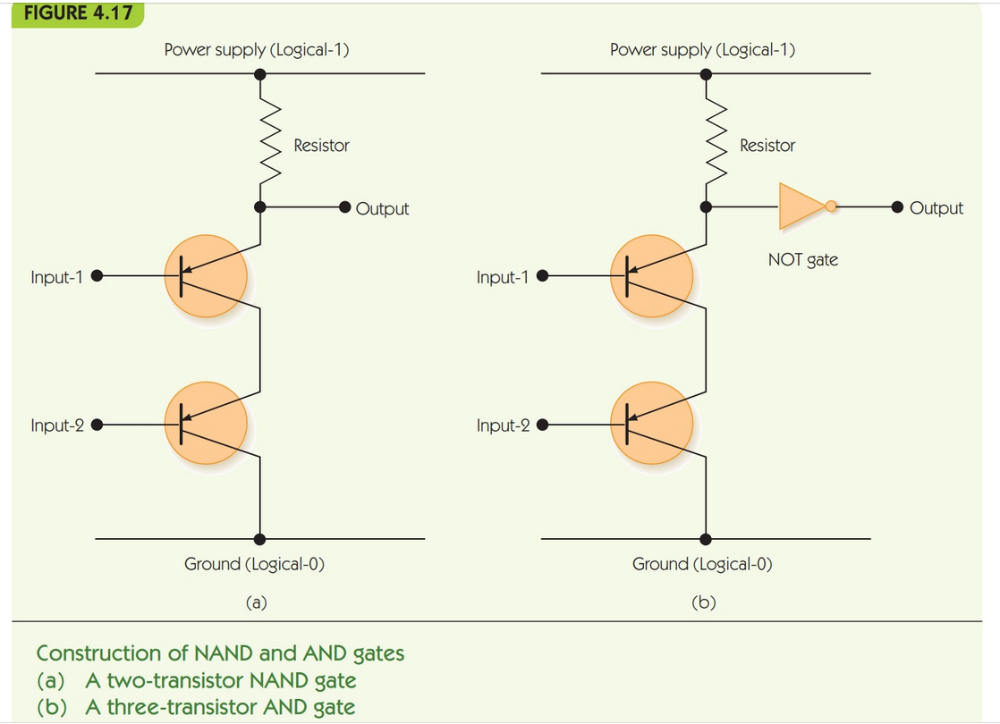
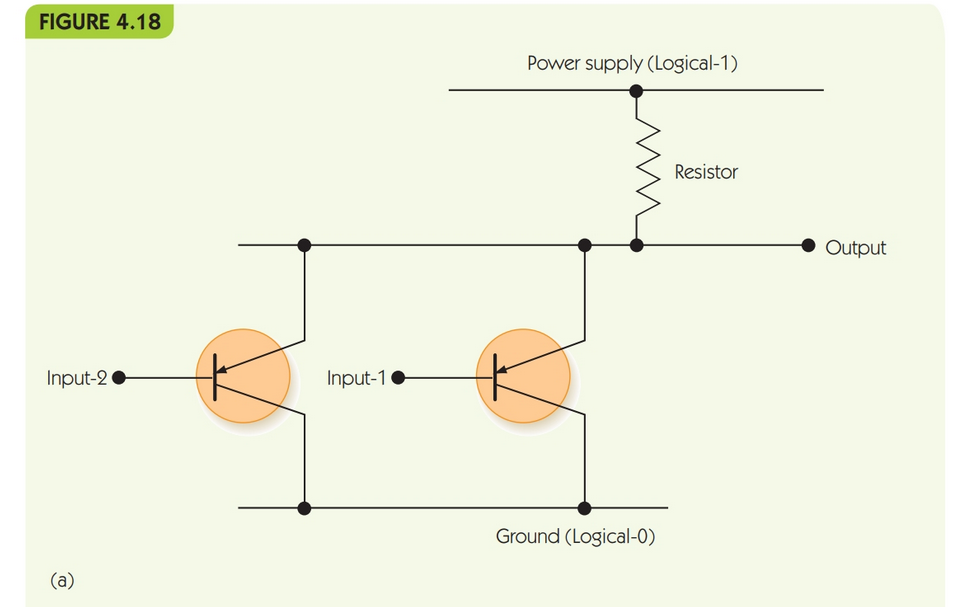
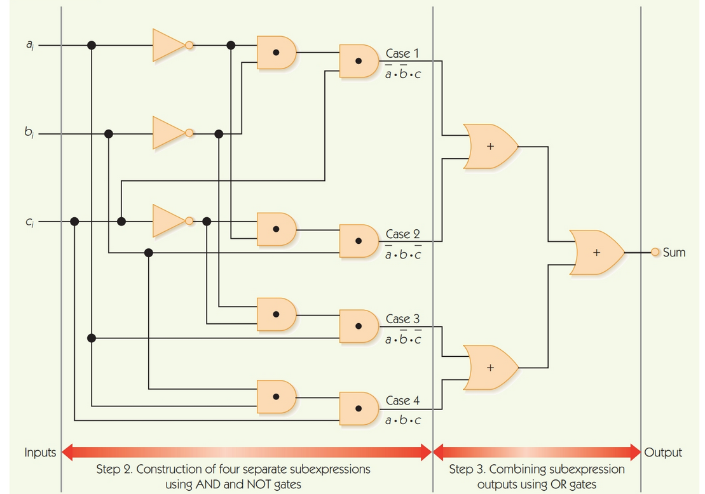

.. I'm on page 214/214 right now <-- DONE
.. Challenge work required, page 217 question 3 <-- NOT STARTED
.. assignment 2 is one exercise from chapter 4 page 215, question 19. and chapter 5 page 270, question 4. <-- NOT STARTED

Unit two, section one
++++++++++++++++++++++

General reading notes
======================

* 10 decimal is numerics, and sign/magnitude is +(n) or -(n) notation. Decimal notation is used for real numbers, and a decimal point separates fractional parts. Alpha chars for A-Z.
* Computers use an internal and external representation of these, what the machine sees and what we see are different.
* Internally, computers use binary.
* Binary is a base 2 positional numbering system.
* Decimal is a base 10.
* In a base 2 positional numbering system, the worth of a number is based on it's position, not it's value.
* Bits is the contraction of binary and digits.
* Any whole number that can be represented in base 10, can be represented in base 2, but it will take more digits to represnt a decimal digit in binary.
* To convert decimal to binary, we use the decimal to binary algorithm, dividing the decimal by two and examining the quotient. The remainder represents the binary of 1 or 0. We do this again until the decimal value has a quotient of 0.
* In every computer, there is a maximum of binary digits that can be used to store an int. Usually, 16, 32, or 64 bit systems.
* in an 8 bit, max value is 11111111. In 16 bit, it would be 16x1 for a total of 65,535 bits. Anything over this cannot be represented without a higher bit system.
* Attempting to represent a binary digit larger would result in a buffer overflow, or arithmetic overflow.
* One of the differences in math and computer science is that in math, a quantity can take any representation. Computer science deals with finite representations, and it has to handle errors for exceeding those.
* In binary addition, if you add 1+1 you get 10, which in base 2 is a total of 2.
* I recommend looking up a video on how to add binary numbers, because the text book doesn't present this well. It's easier to see in a short video.
* Binary can also represent signed integers and characters. For signed ints, it will have a 1 for minus, and 0 for addition. For example 1 110001 is -49, and 0 000011 is +3.
* The meaning of a binary number is based solely on the context in which it's used, meaning that a computer technically doesn't know the difference between 1110001 and 1 110001. It's the context of how we use it.
* This isn't irregular when you think about the english language i.e ball (sports) vs ball (event).
* The reason is to avoid the messy representation of negative zero (1 00000..000) vs zero (0 0000...0000). Consider if a = b, do X. Else do y. What if both are 0, but one is + and the other -?.
* To avoid this, computer designers prefer signed int's that don't suffer the two zero problem, hence the context.
* Two's complement representation is when you write binary patterns in a circular form in increasing order. The positive works clockwise, whereas the negative is counter clockwise.
* In the Two's Complement Representation, there is only a single zero (000 ... 0000). There is a problem with the existence of a singular zero pattern.
* In the two's complement representation, you always have one more negative number than positive. 
* This is not as severe a problem as having two zeroes.
* The two's complement is widely used.
* Fractional numbers can be conveted to binary, but first need to be converted using scientific notation. +- M x B ^+-E. M is the mantissa, B is the exponent base, usually 2 and E is the exponent.
* Textual information is stored in binary via a preallocated number, called code mapping. for example, in an 8 bit system, A could be 1. This again means the machine determines if it's char A or decimal 1, based on context.
* ASCII = american standard code for information interchange, and it uses 8 bits to represent chars. It can encode a total of 2^8 or 256 chars.
* ASCII assigns int chars 0 to 255. 32-126 are printable chars, the remainder are non printed chars.
* UNICODE uses 16 bit and is increasingly popular. 2^16 or 65,536 chars allows more symbols. Unicode has 50000 mapping in it's standard.
* Sound is analog information. In analog representation, objects can take any value.
* The amplitude of a wave is equivalent to volume. The period of a wave is designated as T, and corresponds as time.
* f is frequency, the number of cylces per unit time, measured in cycles per second *hertz* hz. The equation is f=1/T. Frequency is a measure of pitch.
* The higher the frequency, the higher the tone pitch. Humans can hear 20 to 20,000 hz.
* To store a frequency waveform, analog must be digitized. This is called sampling.
* The accuracy of encoding and decoding these waveforms is dependent on sampling rate and bit depth. 
* Sampling rate measures how many times per second we sample the amplitude of the waveform.
* To be effective, it needs to be nearly double the hz a human can hear, totalling 40,000 samples per second.
* The bit depth is the number of bits used to encode each sample.
* Most audio encoding schemas use either 16 or 24 bit encoding, allowing 65000 or 16000000 distinct amplitude levels.
* The textbook lists popular encoding schemas WAV (waveform audio format), AAC (advanced audio coding), WMA (windows media audio), MIDI (musical instrument digital interface) and MP3, MPEG-1 audio level 3 encoding. MPEG = motion picture experts group.
* MP3 uses 44100 samples per second, 16 bit.
* encoding process in imagery is called scanning. Scanning measures the intensity values of distinct points located at regular intervals across the images surface.
* These points are called pixels.
* We store different values of bits in each pixel to make use of grayscale. As an example, a pixel with 3 bits can have 2^3 or 8 shades of increasing intensity, whereas a pixel with a bit option of 1 or 0 would produce a stark black and white image.
* This technique is used in raster graphics, JPEG (joint photographer experts group), GIF (graphics interchange format).
* colour is the same, though we need to encode a value for colour as well (usually RGB)
* It uses one byte, or 8 bits, for each colour ranging a value of intensity from 0 to 255.
* For example, magenta is  RGB 255, 0, 255.
* True colour is an encoding system that uses 3 bytes per pixel, or 24 bits to get over 16 million colours (used in jpeg).
* Some image representation techniques reduce values by using a color palette, since storing 16mil+ colours is memory intense.
* Technically, if you support 16mil+ colours, you can only use 256 at any one time.
* With 256, you can encode each pixel using 8 bits rather than 24 since 2^8 is 256, reducing storage space by 67%.
* Each of the 256 doesn't represent an RGB colour, but an index into a palette or colour table.
* This technique is used in GIF, which holds as few as 2 colours, or as high as 256.
* Music and sound take far more resources than text. You can always calculate by taking the sampling or scanning, or encoding and multiplying by the number of pixels, samples, or chars.
* Compression schemas are evaluated by their compression ratio, which measures how much they reduce the storage requirements of the data.
* Compression ratio = size of uncompressed data / size of compressed data
* Lossy compression schemas compress data in a way that doesn't gaurantee all of the information will be intact.
* The tradeoff for accuracy is a better compression ratio.
* Octal = base 8. Ternary = base 3. Hexadecimal = base 16.
* Computers use binary for electronic reliability, not theoretical limitation.
* As an electronic device ages, voltages may shift, so representing base 10 voltages would be problematic since +5 vdc could quickly become +10 vdc if the shift is ambiguous and inbetween, i.e, 6.75 vdc... will it round up or down?
* The problem with another representation is that it requires equal stable states.
* Electronics operate best in a bistable environment in which there are only two states, separated by a huge energy barrier and not a gradual drift.
* Counterclockwise magnetic fields represent 0, and clockwise represent 1. These are found in core memory, from the term magnetic cores. A core is a small iron oxide coated doughnut. The direction of throughput from ferric oxide is rightmost in counterclockwise 0, and leftmost in clockwise 1. These are found in memory.
* 1 GB has more than 8 billion bits. Cores were swapped out for transistors to accomodate mass memory amounts.
* Transistors are made of semiconductors, silicon and gallium arsinide. They can be printed onto waffer-like silicon chips, known as an integrated circuit or chip. These transistors can switch on and off states in a billionth of a second.
* The benefit to this construction using photographic production is that a mask can be produced, which can repeat copies of the chip like a mold.
* Transistors and chips are an area of physics and electrical engineering.
* Each transistor has three lines, two input lines and one outpute line. The input lines are collector and control, and the output line is the emitter.
* Control is the base, it opens and closes the relay. When control is 1, the switch is closed and the circuit is ON.
* When control is ON, energy passes through the collector through a straight path (the output line called the emitter).
* Moores law states transistors double on a CPU every two years, improving performance. Moores law predicts a demise since we would need to eventually put transistors within an atomic distance of eachother. Currently we are around 100 nm.
* We may be able to solve this in the upcoming breakthroughs in quantum computing.
* The construction of computer circuits is based on boolean logic.
* The area of computing regarding boolean logic is known as hardware design, or logic design.
* In computing, 1 = true. 0 = false.
* x = 1 can be considered a boolean expression because if x=1, its true. if not, its false. Liekwise x!=1 and c > 2.5 can be seen as boolean expressions.
* boolean operators are AND OR and NOT.
* a truth table can show the boolean logic outcomes.
* AND can be written (x>y) AND (x<100) or (x>y) . (x>100). The dot in the center can indicate the boolean logic expression AND.
* OR is written (x + y), and its true if if either or both are true.
* NOT is different. OR and AND require two operators, binary operators, but NOT only needs one -- a unary operator.
* NOT is written with a small line above the variable. It's weirdly somewhat backwards. If NOT a is true, it means that the value of a is false. If the value of a were true, then NOT a is false.
* The fundamental logic behind computers isn't necessarily the transistors, but the logic gates implemented by boolean logic at the silicon level.
* The rules of logic date back over 2,300 years ago to the Greeks, which was expanded by George Boole 150 years ago.
* A gate is an electronic device that operates on a collection of binary inputs to produce a binary output.
* NAND is the exact opposite of AND. Its highly used in hardware design, and stands for NOT AND.
* NOR is an acronym for NOT OR.
* a circuit is a collection of logic gates, that transforms a set of binary inputs into a set of binary outputs.
* the values of the outputs depend only on the values of the inputs.
* This type of circuit is called a combinational circuit.
* Each AND and OR gate must have two inputs and one output.
* Multiple AND and OR gates exist, but they aren't frequently used.
* Each NOT gate must have exactly one input and one output.
* using pictorial representation may be better for design. Boolean expression can help plan mathematical verification and optimization.
* Sequential circuits use a feedback loop to use the output of the previous run as a new input for the next run. They're used to build memory circuits since they in a way can contain memory.
* You can split or tap a line and send its value to different gates. 
* George booles "not very important work" is the basis of computer design. All we need are gates in circuits, and boolean logic.
* The inventor of the transistor is william shockley, along with john bardeen and walter brattain while working at Bell labs. Shockley left to set up chockley semiconductor lab in silicon valley, instrumental to its tech growth.
* Control circuits dont do arithmetic, they instead manage the order of operations. They are sequencing decision making circuits. They're important because a computer must know what to execute in order and be sequential.
* A multiplexor circuit has 2^n input lines and 1 output line. Functionally it copies the binary input of two lines and puts the output on one line. The multiplexor chooses one specific input by a selector line, which can be an additional set of (n) lines.
* The total number of lines in a multiplexor circuit is 2^n + (n).
* A decoder circuit is opposite to a multiplexor circuit, where a decoder circuit has (n) input lines and 2^n output. It's the job of the decoder to determine the value represented on its (n) input lines and send a signal on its single output line that has an identification number.
* Multiplexors and decoders are control circuits that allow us to build computers.

Data compression techniques
============================

Run-length encoding
~~~~~~~~~~~~~~~~~~~~
Replace a sequence of identical values by a pair of values, which indicates the value is replicated (n) times. If both x and (n) require 1 byte of storage, then the reduced total of bytes goes from (n) down to 2.

example:

.. image:: ../images/cs200-run-length.png

Run length is a lossless compression schema.

Variable-length encoding
~~~~~~~~~~~~~~~~~~~~~~~~~~
Often used to encode text, but can be used with other forms. In essence, shorter codes are given to frequent common values, and longer codes for less common values.

Variable length is a lossless compression schema.

Requirements for constructing a computer
~~~~~~~~~~~~~~~~~~~~~~~~~~~~~~~~~~~~~~~~~
You can build a binary computer and its internal components using any hardware with the following criteria.

1. The stable states need to be bistable.
2. The two states need to have a large energy barrier.
3. You need to be able to sense the state the device is in without permanent destruction.
4. You can switch between the states without immense energy.

Gate schematics 
================
A gate is an electronic device that operates on a collection of binary inputs to produce a binary output.

It transforms a set of 0,1 input values into a single output value of 0 or 1, according to specific transformation rules.

The reason we use gates rather than transistors is that a transistor is too elementary to act as a fundamental design component. It needs a designer to deal with low level currents, voltages, and physics. When you group transistors together, you get more powerful building blocks (called gates).

Once we have gates, we can deal with more complex expressive mathematics instead of lower level discrete physics.

The shift from transistors to gates is one of the many examples of abstraction in computer science.

A **NOT** gate can be created from a single transistor, since the collector is connected to the power supply and the emitter is connected to logical ground.

To create an AND gate, we connect two transistors in series:

When you want to build an **AND** gate, all you have to do is add a **NOT** gate to the circuit.

.. note:: 
   A NAND gate requires two transistors, whereas the AND gate requires three. This is why NAND gates are widely used to build computer circuits, since they require less transistors.

To construct an **OR** gate, we use two transistors connected in parallel, not in series.

To convert a **NOR** gate to an **OR** gate, we add a **NOT** gate to the output line.

The sum of products algorithm
~~~~~~~~~~~~~~~~~~~~~~~~~~~~~~
One of the many circuit construction algorithm methods is the sum of products algorithm.

.. note:: 
   This algorithm doesn't always produce an optimal circuit, where optimal means that the circuit accomplishes its desired function using the smallest number of logic gates. Using optimal circuits saves real money, since each gate takes up costs in material and requires power to operate. Algorithms for circuit optimization are an important sub-area of computer design.

1. Truth table construction - construct a truth table. The truth table will help to know what subsequent steps you'll need in the algorithm.

2. Subexpression construction using AND and NOT gates - choose any output column from the truth table, and where a 1 exists, build a boolean logic gate that outputs true and only true for that output. Each of the instances with a 1 in the output are considered a case, and they need a boolean expression.

3. Subexpression combination using OR gates - take the AND and NOT gates from step 2 and combine them two at a time using OR gates.

4. Circuit diagram production - construct the final circuit diagram. Convert the boolean expression into a circuit diagram using gates to implement the operators. 

Compare for equality algorithm
~~~~~~~~~~~~~~~~~~~~~~~~~~~~~~~
Also known as the CE circuit, it tests two unsigned binary numbers for exact equality. The circuit produces the value 1 for true if the two numbers are equal and the value 0 is false.

1-bit compare for equality is represented as 1-CE. 1-CE compares two 1-bit values, a and b, for equality. If both the inputs are the same, the output is true. Otherwise, it's false.

1. Create a truth table
2. Create a subexpression for cases 
3. Combine them with an OR gate
4. Create the circuit diagram

N-nit compare for equality circuit (called CE)
~~~~~~~~~~~~~~~~~~~~~~~~~~~~~~~~~~~~~~~~~~~~~~~
Because numbers in computers are usually larger than one digit, we use an (n) of the 1-CE circuit. 

To check if all 1-CE circuits produce a 1, we AND together the outputs of (n) 1-CE.

Addition circuit algorithm
~~~~~~~~~~~~~~~~~~~~~~~~~~~~
The ADD circuit performs binary addition on two unsigned n-bit ints. It's called a full adder.

Similar to the CE, 1-ADD signifies that it's adding a single pair of binary digits, along with the carry digits.

Each ADD circuit uses 3 NOT gates, 16 AND gates, and 6 OR gates for a total of 25 logic gates. To perform a 32 bit binary addition, its 32 x 25 = 800 gates. It will take 2,200 transistors to build a 32 bit adder circuit.

Challenge work submission
===========================

1. Read chapter four of the textbook.
2. Complete challenge work #3, on page 217 of the text.

.. note:: 
   Corresponds to challenge work #3 on page 217 of the text.

Works cited
~~~~~~~~~~~~
