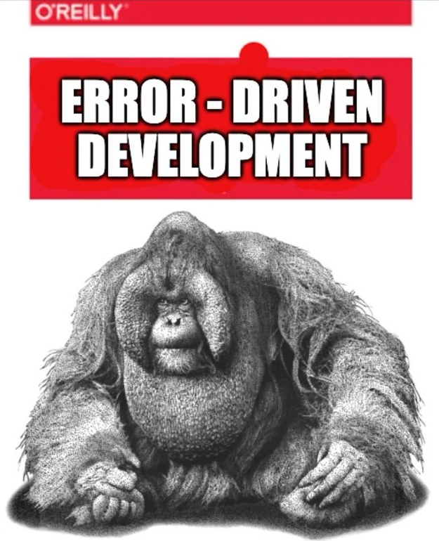

# Come watch me lose my mind

If you've found this repo, you might be studying CS200 with me. I’ve taken a somewhat unconventional path. I got a job working in computing, and, generally speaking, I know how to code and program. I automate solutions every week, build websites, create plugins for the Atlassian marketplace, and write a lot of developer documentation for APIs. 

I know how to write something that works, but as things became more complex, I realized how little I truly knew. I never understood *why* it worked.

So here I am, figuring out why my bug-driven, brute-force development works—and why it doesn’t.

The project includes documentation to support CS200, the prerequisite course that will unlock my continued learning in computer science.

